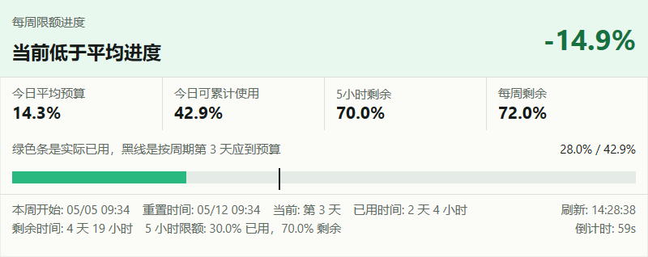
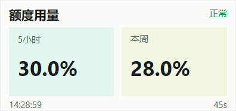

# Codex Usage Monitor

Codex Usage Monitor 是一款原生 Windows 桌面小工具，用來查看目前 Codex 帳號的用量限制。

程式使用 Win32、Direct2D、DirectWrite 與 WinHTTP 開發，不需要 C#、WebView 或額外的背景服務。

English documentation: [README.md](README.md)

## 功能

- 顯示每週用量，以及官方資料提供時的五小時用量窗口。
- 顯示已使用百分比、剩餘百分比、預期速度、實際速度與重設倒數。
- 支援完整、簡單與工作列三種顯示模式。
- 完整與簡單模式使用透明 Codex 懸浮球。
- 支援拖曳、調整大小、鎖定位置、永遠置頂與開機自動啟動。
- 提供 20% 到 80% 的玻璃透明度設定。
- 預設每 60 秒自動重新整理，也可以手動重新整理。
- 支援英文與台灣繁體中文介面。
- 只讀取額度重設資訊，不會消耗或重設額度。
- 設定儲存於 `%APPDATA%\CodexUsageMonitor\settings.ini`。

## 畫面預覽

### 完整模式



### 簡單模式



## 資料與隱私

程式會讀取電腦上既有的 Codex 驗證檔案：

- `%USERPROFILE%\.codex\auth.json`
- 若有設定 `CODEX_HOME`，則讀取 `%CODEX_HOME%\auth.json`

程式使用現有的 access token 向 Codex 後端請求用量資料。專案不包含驗證 Token、密碼或個人帳號資料。請勿將自己的 `auth.json`、環境設定檔或建置產物提交到版本庫。

## 系統需求

- Windows 10 或更新版本
- 已安裝 MSVC C++ 工具鏈的 Visual Studio
- 若使用 CMake 建置，需另外安裝 CMake

## 建置

### 直接建置

```cmd
build.cmd
```

產生的執行檔為 `CodexUsageMonitor.exe`。

### 使用 CMake 建置

```powershell
cmake -S . -B build -G "Visual Studio 18 2026" -A x64
cmake --build build --config Release
```

如果電腦上沒有上述產生器，請改用已安裝的 Visual Studio 產生器。

### 建置並執行測試

```powershell
cmake -S . -B build-tests -G "Visual Studio 18 2026" -A x64 -DCODEX_USAGE_MONITOR_BUILD_TESTS=ON
cmake --build build-tests --config Release
ctest --test-dir build-tests -C Release --output-on-failure
```

## 使用方式

- 在完整或簡單模式中，將滑鼠移到懸浮球上即可展開。
- 點擊懸浮球或展開面板，可以固定展開狀態。
- 拖曳懸浮球或面板即可移動位置。
- 拖曳完整面板的右側、底部或右下角即可調整大小。
- 使用右鍵選單重新整理、切換顯示模式、調整透明度、開啟開機啟動、鎖定位置或離開程式。

工作列模式會固定停靠在工作列附近，不會因滑鼠移入而展開。

## 專案結構

```text
src/       程式主體與用量資料處理
tests/     原生測試與原始碼契約測試
assets/    字型、圖示與執行時資源
IMG/       README 畫面預覽
docs/      公開設計與技術文件
```

## 已知限制

- 尚未實作 access token 自動更新；現有 `access_token` 必須仍然有效。
- 用量解析器依賴 Codex 後端回應格式。
- 如果後端沒有提供五小時窗口，程式會顯示無資料，不會自行推算。
- 本程式是桌面浮動小工具，不是舊版 Windows Gadget 平台。

## 授權

目前專案尚未包含授權檔案。如果需要他人使用或散布，請先加入適用的授權條款。
