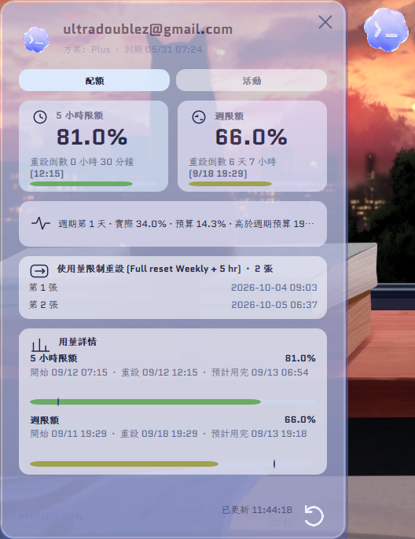
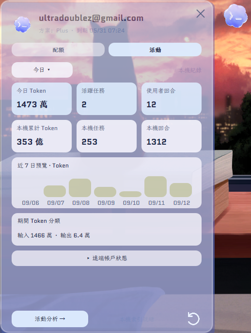
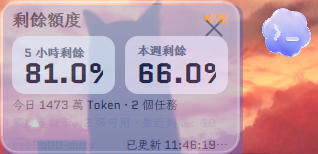
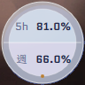
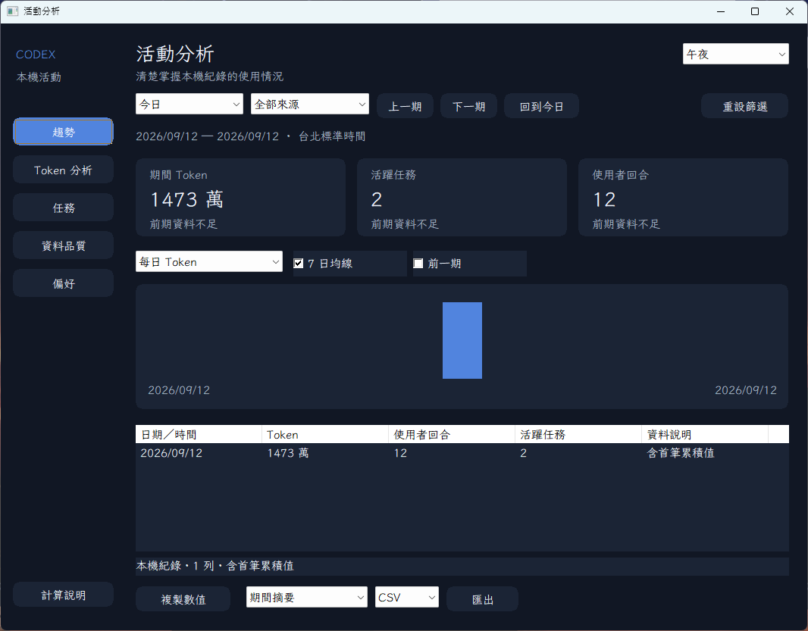

# Codex Usage Monitor

Codex Usage Monitor 是一個開源的原生 Windows 桌面工具，用來監控
Codex 帳戶額度、重置狀態與本機開發活動。

它結合遠端額度監控與從 Codex 工作階段紀錄產生的重視隱私本機分析，
提供用量、token 活動、工作、趨勢與重置時間窗口的持續檢視，不必直接
查看原始工作階段檔案。

程式以 C++20、Win32、Direct2D、DirectWrite 與 WinHTTP 建置，支援鍵盤/
滑鼠操作，以及在複數螢幕之間移動。

[English README](README.md)

## 截圖

### 完整模式 — 額度



### 完整模式 — 本機活動



### 簡單模式



### 工作列模式



### 活動分析



## 功能

### 遠端額度監控

- 讀取 Codex 額度端點，顯示五小時額度與每週額度。
- 顯示已使用與剩餘百分比、重置倒數、重置時間、推算的額度週期開始時間，以及進度條。
- 在端點回傳時顯示目前帳戶電子郵件與方案資訊。
- 在完整模式的配額區塊正下方，以獨立區塊顯示目前剩餘積分。
- 顯示週期進度：目前實際用量與預期預算的比較，以及低於或高於預算的狀態。
- 在資料可用時顯示遠端端點狀態，包括允許使用、達到限制，以及端點回傳的限制類型。
- 在帳戶回應提供相關欄位時，顯示 credits、超額使用、支出控制與餘額資訊。
- 顯示額度重置 credits 的唯讀清單、可用數量與到期時間。程式刻意不會消耗 credits，也不會送出重置請求。
- 支援手動重新整理，以及 1、3、5、10、30 分鐘的自動重新整理間隔。
- 任一額度窗口剩餘 2% 或以下時顯示警告視窗；額度恢復前會去除重複提醒。
- 可從程式選單檢查 GitHub 是否有較新的版本。

遠端額度與本機活動是分開的資料來源；本機活動統計不會改變遠端額度畫面。

### 三種顯示模式

- **完整模式** — 可調整大小的玻璃風格面板，包含「額度」與「活動」分頁。
- **簡單模式** — 緊湊顯示五小時與每週剩餘百分比、本日活動統計、重置 credits 與下一個到期時間。
- **工作列模式** — 96×96 的圓形緊湊指示器，顯示五小時與每週數值及狀態圓點；固定靠近目前工作列，不會因滑鼠移入而展開。

浮動小工具啟動時是迷你圖示。滑鼠移入會展開，點擊後會固定展開狀態，關閉/收合控制可回到迷你圖示。支援拖曳、適用模式的調整大小、鎖定位置、永遠置頂、開機啟動，以及重設位置。

程式使用 Per-Monitor-V2 DPI 感知。浮動模式使用 Windows 虛擬桌面座標，因此可以在複數螢幕之間拖曳，也支援螢幕位於主螢幕左側或上方等負虛擬座標配置。工作列模式則依照小工具所在螢幕的工作區定位。

透明度控制範圍是 0% 至 80%；數值越高，玻璃越透明。目前的繪圖方式刻意避免原生矩形背景，確保圓角小工具外的透明像素不會出現透明外框。

### 本機活動分析

本機收集器會掃描 Codex 工作階段紀錄，建立增量更新的本機索引。資料來源包括：

- 有設定 `%CODEX_HOME%` 時使用該路徑，否則使用 `%USERPROFILE%\.codex`；
- 該目錄下的 `sessions`、`archived_sessions` 與 `session_index.jsonl`；
- JSONL 紀錄中的數值 token metadata，以及工作階段/回合 metadata。

收集器會在背景每 15 秒重新整理一次，追蹤本日與累計總量、工作階段、回合、token 組成、活動日期、掃描涵蓋範圍、封存工作階段、已完成/失敗回合、時間估算、格式錯誤行、無效時間、重複事件、計數器重設與部分掃描狀態。

快取位置是 `%APPDATA%\CodexUsageMonitor\local-usage-cache-v1.tsv`；若 `%APPDATA%` 不可用，會改存於 Codex 資料旁。快取是數值/索引 metadata，不會複製對話文字、標題、檔案路徑或工具參數。

完整模式的「活動」分頁提供本機摘要，並可開啟獨立的活動分析視窗。分析視窗提供：

- 期間：「今天」、「昨天」、「最近 7 天」、「最近 30 天」、「本週」、「本月」、「全部紀錄」與「自訂日期」；
- 來源篩選：「所有來源」、「明確的頂層工作」、「非頂層工作」與「未知來源」；
- 「趨勢」、「Token」、「工作」、「資料品質」與「偏好設定」頁面；
- 趨勢圖表：每日 token、每日回合、每日活動工作、日曆熱度圖、星期 × 小時、每小時 token、累計 token，可選七日平均與前一期間比較；
- token 分解、來源分布、期間統計、每日組成比例，以及前五名/其餘項目檢視；
- 可搜尋的工作列，支援工作階段範圍、依 token/最近活動/回合數排序、每頁 25/50/100 筆、本機別名與標籤；
- 資料品質診斷、掃描涵蓋範圍、格式錯誤/無效/重複/重設計數，以及進階能力狀態；
- Porcelain、Midnight、Forest、Plum 四種主題；
- 純本機的每日基準、每日目標、緊湊數字偏好設定，以及與圖表對應、可使用鍵盤操作的資料表；
- 「複製數值」、CSV 匯出與 JSON 匯出。匯出前會提供預覽，並可包含 Summary、Daily rows、Task rows 與 Data quality 表格；活動分析匯出的工作階段識別碼會匿名化；
- 「掃描本機」、「重建索引」與「取消」操作。

活動分析只使用本機資料；當紀錄無法讀取或解析時，結果可能標示為部分資料。它不代表遠端帳戶額度。

### 語言與視覺設計

- English 與台灣繁體中文介面。
- 程式選單、額度/活動頁面、設定、分析頁面、狀態訊息與匯出標籤皆有在地化文字。
- 使用 DirectWrite 與隨附的英文字型、中文字型資源進行原生文字繪製。
- Token 數量支援大型數字格式化，包含繁體中文常用的緊湊表示法。

## 資料來源、隱私與限制

### 遠端帳戶資料

程式依照以下順序尋找 access token：

1. `CodexUsageMonitor.exe` 旁的 `auth.json`；
2. `%CODEX_HOME%\auth.json`；
3. `%USERPROFILE%\.codex\auth.json`；
4. 執行檔備援位置下的 `.codex\auth.json`。

檔案必須包含 `tokens.access_token`。該 token 僅用於向遠端端點取得額度資料，絕對不應提交到 repository。程式目前沒有自動更新 access token 的功能；token 過期時，請使用一般 Codex 登入流程重新取得。

### 本機活動資料

程式在本機讀取工作階段檔案並轉換成統計資料。本機快取刻意只保留數值/索引 metadata，不保留對話內容。若檔案不可用、格式錯誤、仍在寫入，或超出掃描涵蓋範圍，活動紀錄可能不完整。

解析器依照目前 Codex 產生的工作階段紀錄格式運作；若紀錄格式或遠端端點改變，對應資料可能暫時無法取得，直到更新解析器。

## 設定與保存

主要設定檔：

`%APPDATA%\CodexUsageMonitor\settings.ini`

如果 `%APPDATA%` 不可用，程式會改用執行檔旁的設定檔。程式會保存顯示模式、完整模式分頁、語言、透明度、重新整理間隔、位置、大小、永遠置頂、鎖定位置與開機啟動等設定。

活動分析偏好設定會保存於由主要設定路徑衍生的 sidecar 檔案：

`settings.ini.activity-v1.ini`

其中包含分析主題、頁面/篩選狀態、圖表選項、緊湊數字偏好設定、每日目標，以及工作別名/標籤。

## 系統需求

- Windows 10 或更新版本。
- 安裝 Windows SDK 的 Visual Studio C++ 桌面開發工作負載。
- CMake 3.21 或更新版本。
- 若要顯示遠端額度，需要 Codex 安裝提供可讀取的 `auth.json`；只要有工作階段紀錄，本機活動分析仍可獨立運作。

本專案是原生 Win32 應用程式，不是舊式 Windows Gadget 套件。

## 建置

請在 Visual Studio Developer PowerShell 中使用 CMake：

以下指令使用目前開發環境的 Visual Studio 18 generator；如果你的 Visual Studio 版本不同，請替換成該版本對應的 generator 名稱。

```powershell
cmake -S . -B build -G "Visual Studio 18 2026" -A x64
cmake --build build --config Release
```

執行檔會產生於 `build\Release\CodexUsageMonitor.exe`。請將產生的 `assets` 目錄保留在執行檔旁，因為小工具圖示與字型會在執行時載入。

建置並執行 C++ 測試：

```powershell
cmake -S . -B build-tests -G "Visual Studio 18 2026" -A x64 `
  -DCODEX_USAGE_MONITOR_BUILD_TESTS=ON
cmake --build build-tests --config Release
ctest --test-dir build-tests -C Release --output-on-failure
```

測試涵蓋顯示狀態 helper、活動分析、視窗互動與 source contract。

開發者 UI 視窗情境也可由 CMake 啟用：

```powershell
cmake -S . -B build-ui -G "Visual Studio 18 2026" -A x64 `
  -DCODEX_USAGE_MONITOR_UI_TEST_WINDOW=ON `
  -DCODEX_USAGE_MONITOR_UI_TEST_SCENARIO=0
cmake --build build-ui --config Release
```

支援的情境值為：`0` 額度、`1` 活動、`2` 簡單、`3` 工作列、`4` 中文活動、`5` 第二螢幕額度。這些情境用於本機 UI 驗證，並需要正常的 Windows 桌面環境。

## Repository 結構

```text
src/       Win32 應用程式、額度取得器、本機索引、分析與視窗
tests/     C++ 測試與 source-contract 檢查
assets/    執行時圖示與字型資源
IMG/       README 截圖
docs/      輔助設計與驗證文件
```

## 疑難排解

- **遠端額度無法取得：** 確認實際執行的 EXE、上述 auth 檔案搜尋順序，以及 `tokens.access_token` 是否存在。過期 token 不會自動更新。
- **本機總量為空或顯示部分資料：** 確認 `%CODEX_HOME%`/`%USERPROFILE%\.codex`、`sessions` 與 `archived_sessions` 目錄，以及「活動」頁面顯示的快取/索引狀態。
- **小工具在錯誤的螢幕：** 先使用「重設小工具位置」；若位置已鎖定，先解除鎖定，再將浮動小工具拖過虛擬桌面。Windows 的螢幕排列與各螢幕縮放會由程式分別處理。
- **小工具太不透明或太透明：** 開啟選單中的「透明度」設定；支援範圍為 0–80%。
- **圖示或字型遺失：** 確認 `assets` 目錄位於執行檔旁。

## License

Codex Usage Monitor 原始專案內容採 MIT License 授權，請參閱
[LICENSE](LICENSE)。

隨附的第三方資產仍依其各自的授權條款提供，詳見
[THIRD_PARTY_NOTICES.md](THIRD_PARTY_NOTICES.md)。
