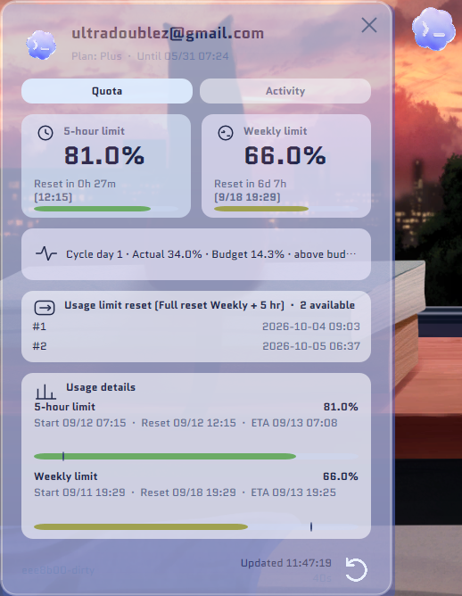
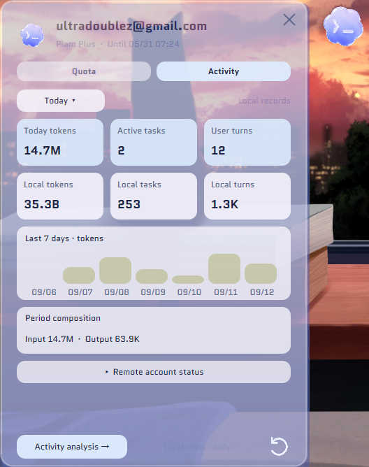
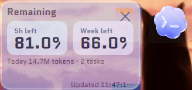
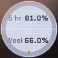
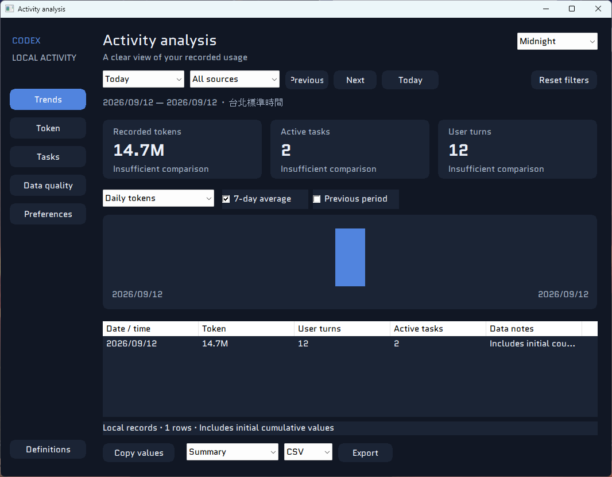

# Codex Usage Monitor

Codex Usage Monitor is a native Windows desktop widget for two kinds of information:

- remote Codex account quota and reset status;
- local, read-only activity statistics derived from Codex session records.

It is implemented with Win32, Direct2D, DirectWrite, WinHTTP, and C++20. The application is designed to stay lightweight, keyboard/mouse friendly, and useful while working across multiple monitors.

[繁體中文說明](README-zh.md)

## Screenshots

### Full mode — quota



### Full mode — local activity



### Simple mode



### Taskbar mode



### Activity analysis



## Features

### Remote quota monitoring

- Reads the Codex usage endpoint and displays the five-hour and weekly windows.
- Shows used and remaining percentages, reset countdowns, reset timestamps, estimated window start times, and progress bars.
- Shows the current account email and plan information when returned by the endpoint.
- Shows cycle pace: actual usage versus the expected budget, including below-budget or above-budget status.
- Shows the remote endpoint state when available, including allowed, limit reached, or the returned rate-limit type.
- Shows credits, overage, spend-control, and balance information when the account response provides those fields.
- Shows the available rate-limit reset-credit inventory and expiry times. This is intentionally read-only: the application does not consume credits or send a reset request.
- Supports manual refresh and configurable automatic refresh intervals of 1, 3, 5, 10, or 30 minutes.
- Checks for a newer GitHub release from the application menu.

Remote quota and local activity are separate data sources. Local activity totals do not alter the remote quota display.

### Three presentation modes

- **Full mode** — a resizable glass-style panel with Quota and Activity tabs.
- **Simple mode** — a compact summary showing five-hour and weekly remaining percentages, local today totals, reset credits, and the next expiry.
- **Taskbar mode** — a compact circular 96×96 indicator showing five-hour and weekly values plus a status dot. It remains docked near the current taskbar and does not expand on hover.

The floating widget starts as a small bubble. Hovering expands it, clicking pins the expanded view, and the close/collapse control returns it to the bubble. The widget supports dragging, resizing where applicable, position locking, always-on-top, startup launch, and resetting its position.

The process is Per-Monitor-V2 DPI aware. Floating modes use the Windows virtual desktop, so they can be dragged between monitors—including monitor layouts with negative virtual-desktop coordinates. Taskbar mode follows the work area of the monitor containing the widget.

The transparency control ranges from 20% to 80%; a higher value makes the glass more transparent. The current rendering intentionally avoids a native rectangular backdrop so transparent pixels outside the rounded widget remain transparent.

### Local activity analytics

The local collector scans Codex session records and builds an incremental local index. It reads:

- `%CODEX_HOME%` when that variable is set, otherwise `%USERPROFILE%\.codex`;
- `sessions`, `archived_sessions`, and `session_index.jsonl` under that directory;
- numeric token metadata and session/turn metadata from the JSONL records.

The collector refreshes in the background every 15 seconds. It tracks today and recorded totals, tasks, turns, token components, active days, scan coverage, archived sessions, completed/failed turns, duration estimates, malformed lines, invalid timestamps, duplicate events, counter resets, and partial-scan state.

The cache is stored at `%APPDATA%\CodexUsageMonitor\local-usage-cache-v1.tsv` (or beside the Codex data when `%APPDATA%` is unavailable). The cache is an index of numeric/index metadata; it does not copy conversation text, titles, file paths, or tool arguments.

Full mode's Activity tab provides a quick local summary and a link to the dedicated analysis window. The analysis window provides:

- periods: Today, Yesterday, Last 7 days, Last 30 days, This week, This month, All records, and Custom dates;
- source filters: All sources, Explicit top-level, Non-top-level, and Unknown source;
- pages for Trends, Token, Tasks, Data quality, and Preferences;
- trend charts for daily tokens, daily turns, daily active tasks, calendar heatmap, weekday × hour, hourly tokens, cumulative tokens, optional seven-day average, and previous-period comparison;
- token breakdown, source distribution, period statistics, daily component ratios, and top-five/remainder views;
- searchable task rows with session scope, token/recency/turn sorting, 25/50/100 rows per page, local aliases, and tags;
- data-quality diagnostics, scan coverage, malformed/invalid/duplicate/reset counts, and advanced capability status;
- four themes: Porcelain, Midnight, Forest, and Plum;
- compact-number and daily-goal preferences, local-only daily reference, and keyboard-accessible data tables corresponding to the charts;
- Copy values, CSV export, and JSON export. Exports provide a preview and can include Summary, Daily rows, Task rows, and Data quality tables. Task/session identifiers are anonymized in exported analysis data;
- Scan local, Rebuild index, and Cancel actions.

Activity analysis is local-only and may be marked partial when records cannot be read or parsed. It does not represent the remote account's quota.

### Language and visual design

- English and Taiwan Traditional Chinese UI languages.
- Localized widget menus, quota/activity pages, settings, analysis pages, status messages, and export labels.
- Native DirectWrite text rendering with the bundled English and Chinese font assets.
- Large-number formatting for token counts, including localized Chinese compact notation.

## Data sources, privacy, and limitations

### Remote account data

The access token is resolved in this order:

1. `auth.json` beside `CodexUsageMonitor.exe`;
2. `%CODEX_HOME%\auth.json`;
3. `%USERPROFILE%\.codex\auth.json`;
4. `.codex\auth.json` relative to the executable's fallback location.

The file must contain `tokens.access_token`. The token is used to request the remote usage data and is never a file that should be committed to the repository. Automatic access-token refresh is not implemented; an expired token must be refreshed by the normal Codex authentication flow.

### Local activity data

Session files are read locally and converted into metrics. The local cache intentionally stores numeric/index metadata rather than conversation content. Activity records can be incomplete if files are unavailable, malformed, still being written, or outside the scan coverage.

The parser follows the session record format currently emitted by Codex. If that format or the remote endpoint changes, the corresponding data may become unavailable until the parser is updated.

## Settings and persistence

The main settings file is:

`%APPDATA%\CodexUsageMonitor\settings.ini`

If `%APPDATA%` is unavailable, the application falls back to a settings file beside the executable. The application persists the selected display mode, full-page tab, language, transparency, refresh interval, position, size, always-on-top state, lock state, and launch-at-startup preference.

Activity analysis preferences are stored in a sidecar file derived from the main settings path:

`settings.ini.activity-v1.ini`

This includes the analysis theme, page/filter state, chart options, compact-number preference, daily goal, and task aliases/tags.

## Requirements

- Windows 10 or later.
- A current Visual Studio C++ desktop-development workload with the Windows SDK.
- CMake 3.21 or later.
- A Codex installation with a readable `auth.json` for remote quota data. Local activity analysis can still operate independently when session records are available.

This project is a native Win32 application; it is not a legacy Windows Gadget package.

## Build

Configure and build the application with CMake from a Visual Studio developer shell:

The command below uses the Visual Studio 18 generator available in the development environment; use the generator name matching the Visual Studio version installed on your machine.

```powershell
cmake -S . -B build -G "Visual Studio 18 2026" -A x64
cmake --build build --config Release
```

The executable is produced under `build\Release\CodexUsageMonitor.exe`. Keep the generated `assets` directory next to the executable because the widget icon and fonts are loaded at runtime.

To build and run the C++ tests:

```powershell
cmake -S . -B build-tests -G "Visual Studio 18 2026" -A x64 `
  -DCODEX_USAGE_MONITOR_BUILD_TESTS=ON
cmake --build build-tests --config Release
ctest --test-dir build-tests -C Release --output-on-failure
```

The test suite covers presentation-state helpers, activity analytics, and window interaction/source contracts.

For developer UI-window scenarios, CMake also supports:

```powershell
cmake -S . -B build-ui -G "Visual Studio 18 2026" -A x64 `
  -DCODEX_USAGE_MONITOR_UI_TEST_WINDOW=ON `
  -DCODEX_USAGE_MONITOR_UI_TEST_SCENARIO=0
cmake --build build-ui --config Release
```

Supported scenario values are `0` quota, `1` activity, `2` simple, `3` taskbar, `4` activity in Chinese, and `5` quota on a secondary monitor. These scenarios are intended for local UI verification and require the normal Windows desktop environment.

## Repository layout

```text
src/       Win32 application, quota fetcher, local indexer, analytics, and windows
tests/     C++ tests and source-contract checks
assets/    Runtime icons and font resources
IMG/       README screenshots
docs/      Supporting design and verification documents
```

## Troubleshooting

- **Remote quota is unavailable:** verify the active executable, the auth-file lookup order above, and that `tokens.access_token` is present. A stale or expired token is not refreshed automatically.
- **Local totals are empty or partial:** verify `%CODEX_HOME%`/`%USERPROFILE%\.codex`, the `sessions` and `archived_sessions` directories, and the cache/index status shown in Activity.
- **The widget is on the wrong monitor:** use Reset widget position, unlock the position if needed, then drag the floating widget across the virtual desktop. Windows display scaling and monitor arrangement are handled per monitor.
- **The widget looks too opaque or too transparent:** open the menu's Transparency setting; the supported range is 20–80%.
- **Fonts or the icon are missing:** confirm that `assets` is beside the executable.

## License

No license file is currently included in this repository. Confirm the intended licensing terms before redistributing the application.
